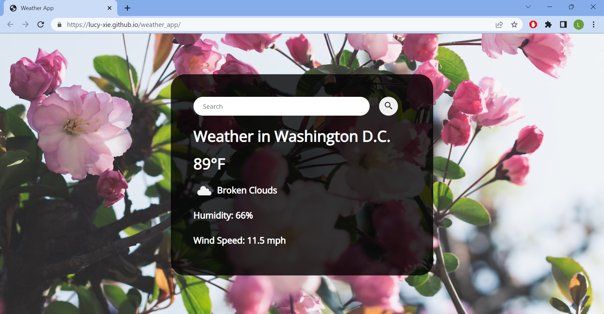

# Weather App

## Goals

- Understand the basics of HTML, CSS, and JavaScript
- Understand how to integrate an API into a project
- Create an aesthetically pleasing and user-friendly UI

## Description
This is a simple weather app that allows the user to check the weather conditions of any city that they search for. It makes use of the Open Weather API to display current and accurate weather conditions such as the temperature, a weather description, humidity, and wind speed. As an aesthetic touch, every time a search is made, the background image will also change to display a random photo of a flower.

## Preview

[Check it out yourself!](https://lucy-xie.github.io/weather_app/)

